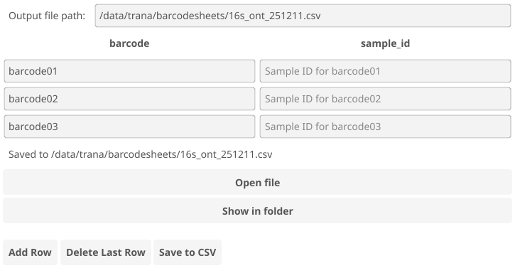

# Bartender

A small GUI application for entering sample IDs and produce a barcode-sheet for
the [TRANA](https://github.com/genomic-medicine-sweden/TRANA) taxonomic
profiling pipeline for 16S rRNA reads, optimized for use with hand scanners.

## Installation

The easiest way to install Bartender is to go to the [releases
page](https://github.com/samuell/bartender/releases), pick the latest release,
and under that, find the download with a pre-compiled version of the software
for your operating system.

## Building

If you want to build the application yourself, you need:

- The [Go toolchain](https://go.dev/)
- The [fyne-cross tool](https://github.com/fyne-io/fyne-cross) (for building statically, which works on more devices)

## Implementation

The application is written in Go, using the [Fyne GUI toolkit](https://fyne.io/).
